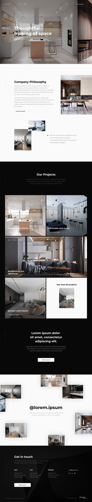

# Modern Interior Design Website

  
A modern and stylish website for an interior design studio, built using **Gulp**, **SCSS**, and the **BEM** methodology.

## 🚀 Technologies Used
- **Gulp** (used during development) - Task runner for automating workflows.
- **SCSS** - Preprocessor for enhanced and modular styles.
- **BEM (Block Element Modifier)** - Naming convention for scalable and maintainable CSS.
- **JavaScript** - For interactive elements.
- **HTML5 & CSS3** - Core web technologies for structuring and styling.

## 📂 Project Structure
```
├── css/            # Compiled CSS files
├── fonts/          # Custom fonts
├── img/            # Images and assets
├── js/             # JavaScript files
├── .htaccess       # Server configuration
├── 404.html        # Error page
├── about.html      # About page
├── contact.html    # Contact page
├── index.html      # Homepage
├── news.html       # News listing page
├── oneNews.html    # Single news page
├── oneProject.html # Single project page
├── project.html    # Projects listing page
├── README.md       # Project documentation
```

## 🔧 Development Setup
This repository contains the **final production build**. Gulp was used only during development, and all necessary files are already compiled in the `dist` folder.

## 🌟 Features
- Responsive and adaptive layout
- Modular SCSS structure
- Automated build process with Gulp (during development)
- Clean and modern UI/UX

## 📸 Preview
[Live Demo on GitHub Pages](https://alexandre-kovalchuk.github.io/ModernInteriorDesignWebsite/)

## 📌 License
This project is open-source and available under the [MIT License](LICENSE).

---
**Developed with ❤️ by [Your Name]**
